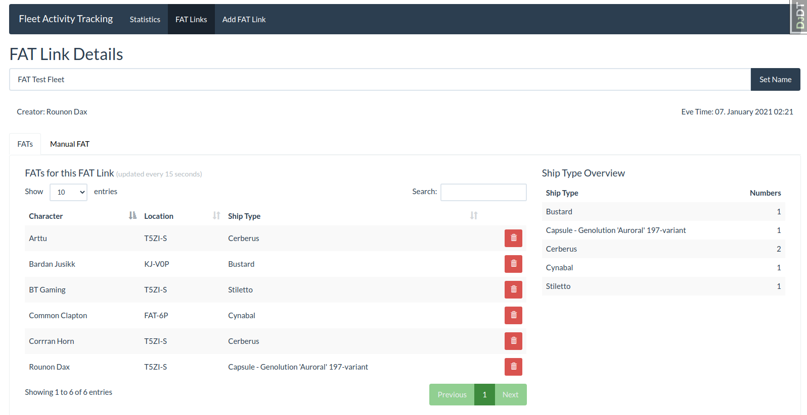
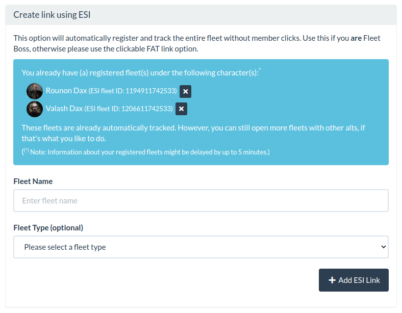

# Change Log

All notable changes to this project will be documented in this file.

The format is based on [Keep a Changelog](http://keepachangelog.com/)
and this project adheres to [Semantic Versioning](http://semver.org/).

## Unreleased

### Added

- Index to `hash` field in AFatLink model (Thanks @ErikKalkoken)

### Changed
- Time period (year and month select) templates refactored
- FAT link hashes in log are now linked to their respoective FAT link details, as
  long as the FAT link is not deleted yet (Thanks to @ErikKalkoken to let me know
  how to do so without firing potentially hundreds of queries against the database)
- Reduced load time for all pages incl. admin site (Thanks @ErikKalkoken)


## [2.1.1] - 2021-04-30

### Added

- Button to close your own ESI fleet to more view. It is now available on the
  Dashboard, in the FAT link list and in the FAT link details view as well. You can
  only close your own ESI fleets.

### Changed

- Manual FAT function limited. It is only available when the FAT link has been
  created within the last 24 hours and has not been re-opened.
- Message templates refactored to make them more maintainable


## [2.1.0] - 2021-04-22

### Changed

- Ability to manually add pilots to FAT link has been disabled for ESI tracked FAT
  links. The reason for this is pretty simple. Since an ESI tracked FAT link is
  continuously tracking the fleet via ESI, all pilot who have been in said fleet are
  added automatically. If someone hasn't been added, said someone wasn't in the fleet.

### ⚠️ Important ⚠️

If you haven't updated to the v2 version yet, do so first and do not go straight to
this version. Read the [update instructions for v2.0.0 please](#-update-instructions-for-v200-)
please.


## [2.0.1] - 2021-04-22

### Fixed

- `django.db.utils.IntegrityError: (1048, "Column 'log_time' cannot be null")` on
  log merge.

### ⚠️ Important ⚠️

If you haven't updated to the v2 version yet, do so first and do not go straight to
this version. Read the [update instructions for v2.0.0 please](#-update-instructions-for-v200-)
please.


## [2.0.0] - 2021-04-21

### Fixed

- Error 500 due to missing ``EveAllianceInfo`` object in statistics view
- Clear content of modal windows when they are closed
- Unique IDs for modals

### Added

- `related_name` to foreign keys in models
- Proper log model
- Proper log messages to fatlink detail view and edit actions to differenciate if
  someone is only viewing or actually editing some details
- Confirmation modal window when closing ESI fleets manually
- Ability to re-open clickable FAT links for a certain time after they have expired.
  FAT links can be re-opened only once though (`manage_afat` permissions are needed
  to re-open FAT links)
- Logs view (`log_view` permissions are needed to view the logs)

### Changed

- Inline JS for DataTables moved to their own files
- Templates restructured
  - Proper directory structure
  - Proper names
- Links restructured
  - Some changes in link names (mostly for ajax calls)
  - Link segment order unified
- Function names following a proper naming convention
- Use swagger spec provided by CCP instead of maintaining our own file
- Migration from ImicusFAT now writes into the new AFAT log table
- Migration from bFAT now writes into the new AFAT log table
- Migration from native FAT module now writes into the new AFAT log table
- Wording in modal windows
- Modal windows merged into one file which is loaded conditionally
- Log messages improved
- Manual FAT log deactivated in favor of the new general log
- Forms for FAT link creation now properly using django forms

### Removed

- Old code for flat lists. Not used anymore and will not be used ever again

### ⚠️ Update Instructions for v2.0.0 ⚠️

---

#### If you are updating from one of the 2.0.0-alpha versions

If you installed one of the alpha versions, make sure to reset your migrations first!
Migrations have been reset during the alpha versions a couple of times.

To do so, run:
```shell
python manage.py migrate afat 0017
```

Once done, proceed with the update as lined out below.

---

This release introduces a new periodic task, make sure to add it to your `local.py`,
besides that, it is the usual steps to update ...

Download and install the new version
```shell
pip install -U allianceauth-afat
```

Add the new task to your `local.py`
```python
CELERYBEAT_SCHEDULE["afat_logrotate"] = {
    "task": "afat.tasks.logrotate",
    "schedule": crontab(minute="0", hour="1"),
}
```

Run static collection and migrations
```shell
python manage.py collectstatic
python manage.py migrate
```

Restart your supervisor.

Finally migrate the Manual FAT log to the new logging table
```shell
python manage.py afat_migrate_manual_fat_log
```


## [1.10.0] - 2021-03-30

### ⚠️ IMPORTANT ⚠️
Before you update to this version, make sure you remove all "deleted" data from
your tables. To do so, log in to your mysql console and run the following commands:

```mysql
# de-activate foreign key checks
SET FOREIGN_KEY_CHECKS=0;

# remove all "deleted" FATs
delete from afat_afat where deleted_at is not null;

# remove all "deleted" fat link types
delete from afat_afatlinktype where deleted_at is not null;

# get all fatlink IDs of "deleted" fatlinks as comma separated list and make sure
# to have that in your notepad saved, you need this list for the next comamnds
select group_concat(id) from afat_afatlink where deleted_at is not null;

# now remove everything that is related to those IDs
# make sure to replace "id_list" with the comma separated
# list of IDs from the earlier command
delete from afat_clickafatduration where fleet_id in (id_list);
delete from afat_afat where afatlink_id in (id_list);
delete from afat_afatlink where id in(id_list);

# re-activate foreign key checks
SET FOREIGN_KEY_CHECKS=1;
```

This step is important before updating, because the "deleted" marker will be lost
during migration! If you don't run this step, you'll have all your FATlinks and FATs
that were previously "deleted" as active again.

### Removed

- Soft deletion mechanism we inherited from ImicusFAT. It's more trouble than it's worth
  and it's not used anyways. So we stick to "delete data when it should be deleted",
  and not just mark it as deleted and keep it as stale data in the table.


### Updated

- Migration information for migration from ImicusFAT in README.md file


## [1.9.0] - 2021-03-20

### Added

- Ship type overview to FAT link detail page (#72)

  


## [1.8.0] - 2021-03-07

### Added

- Ability to "close" ESI fat links manually. (Only the FC creating the link has this
  ability when creating new ESI fat links when he still has registered fleets.)

  


## [1.7.0] - 2021-03-02

### Added

- Setting to change the application name, in case you want it named something specific


## [1.6.0] - 2021-02-04

### Added

- Info when there are already registered ESI links for the FC and with which characters
- A check for already registered fleets on ESI link creation. If the character
  already has a fleet registered, and it is hte same fleet, he gets a message. If it
  is a new fleet, the old fleet will be closed, and the new fleet will be registered.


## [1.5.3] - 2021-02-03

### Fixed

- An issue with sorting by date in datatables


## [1.5.2] - 2021-02-02

### Changed

- Tables look and feel
  - Removed the "actions" header
  - Added hover effect to all tables
  - Added common table style


## [1.5.1] - 2021-01-27

### Changed

- EVE/UTC tz handling optimized


## [1.5.0] - 2021-01-25

### Added

- Ability to create ESI fat links on alts, in case the FC has another fleet on one
  of their alts up and running
- More ESI error handling


## [1.4.5] - 2021-01-20

### Changed

- Views imports optimized

### Fixed

- An issue when the FC switched to another fleet. This was not detected properly, and
  the "old" ESI link was not closed.


## [1.4.4] - 2021-01-11

### Added

- Option to set the default expiry time for clickable FAT links in minutes. If
  nothing es set, 60 minutes will be assumed as default.

## Changed

- Permissions have been completely overhauled and simplified

  | Name | Description | Notes |
  |:-----|:------------|:-----|
  | basic_access | Can access the AFAT module | Your line member probably want this permission, so they can see the module and click the FAT links they are given. They also can see their own statistics with this permission. |
  | manage_afat | Can manage the AFAT module | Your Military lead probably should get this permission |
  | add_fatlink | Can create FAT Links | Your regular FC or who ever should be able to add FAT links should have this permission |
  | stats_corporation_own | Can see own corporation statistics |  |
  | stats_corporation_other | Can see statistics of other corporations |  |

  **Please make sure to read the following before updating!**

  Permissions have been completely redone and simplified. This means, the current
  permissions will no longer apply after the update. Time to clean them up! In order
  to do so, run the following commands **in exactly this order!**

  - _Update the software itself:_
    ```shell
    pip install -u allianceauth-afat
    ```

  - _Open a django console:_
    ```shell
    python manage.py shell
    ```

  - _Remove the modules old permissions:_
    ```python
    from django.contrib.auth.models import Permission
    Permission.objects.filter(content_type__app_label="afat").delete()
    exit()
    ```

  - _Run static collection and migrations:_
    ```shell
    python manage.py collectstatic
    python manage.py migrate
    ```

  **Keep in mind, you have to set the new permission to the states/groups that
  previously had permissions.**


## [1.4.3] - 2021-01-08

### Fixed

- Deal with invalid user profiles. For example when a user has revoked his/her ESI
  access.


## [1.4.2] - 2021-01-07

### Added

- Useragent to ESI calls

### Changed

- Ajax URLs structured
- Internal methods for afat_view renamed to dashboard
- Views modularized
- Dashboard static tables replaced with DataTables which get populated via Ajax calls
- Fleet Edit FAT list table replaced with DataTable
- Statistics now only show alliances and corps when their members have access to the
  module, not just all anymore

### Fixed

- Missing fleet commander added to ESI FAT links. Now the automatic ESI pull also
  works when the fleet commander is an alt of the creator
- Length of form fields adjusted
- Hardened the auto ESI pull against possible ESI hiccups, so ESI FAT links are not
  closed prematurely


## [1.4.1] - 2020-12-24

### Added

- Explanation for the "via Esi" labels in FAT list view
- New "via Esi" label for currently active ESI links


### Fixed

- Prevent user from opening more than 1 ESI fleet


## [1.4.0] - 2020-12-24

### New

ESI links will now be updated automagically. This means, pilots who join later will
still be registered, as long as the FC who created the ESI link is still the actual
fleet boss and didn't close or leave the fleet.


## [1.3.4] - 2020-12-16

### Fixed

- Bootstrap classes in template


## [1.3.3] - 2020-11-28

### Changed
- Reducing characters displayed on stats main view to only those with FATs

### Fixed
- 'NoneType' object has no attribute 'character_name'
  (This happens when the creator of a FAT link for what ever reason lost his main char
  and prevents the FAT link list from being loaded.)


## [1.3.2] - 2020-11-23

### Changed
- couple of tweaks to templates and JS
- show only characters with FAT links in stats main view


## [1.3.1] - 2020-11-22

### Changed
- tables tweaked …
    - preventing DataTables from getting wider than their parent element
    - even/odd styles
    - text alignments


## [1.3.0] - 2020-11-19

### New Feature
- Import scripts for imports from Alliance Auth's FAT module as well as from bFAT
  and ImicusFAT. These imports can be done initially right after the first install of
  AFAT. Fiddling around with SQL to import is no linger needed with this.

### Added
- Filter to the Fat Links List view. You can now filter for Fleet Type and is a
  FAT link was created via ESI or not in the FAT links list.

### Changed
- FAT links information in FAT links list is now loaded via ajax. This means, especially
  for installations with a large number of FAT links, this page should be loaded considerably faster.
- Minimum required version of Alliance Auth set to 2.8.0

### Removed
- Support for Django 2


## [1.2.0] - 2020-10-19

### New
- Added a check to `Clickable FATLinks` to verify whether the character is
  actually online.

### Changed
- Workflow improvements for `ESI FATLinks`
- Show only chars with recent activity in "Recent Activity" view

### Fixed
- Added Average FATs to the monthly corp stats overview.
- Added "Basic Access" permission. This permission prevents unintended audience
  from accessing the module.

### Updating
**IMPORTANT**:
When updating to this version, you will need to give the state/group that should have
access to the AFAT module the
`afat|Alliance Auth AFAT|Can access the Alliance Auth AFAT module` permission.
Without this permission, the user cannot see the link, open any statistics or register
via clickable FATLinks.

To update your existing installation of AFAT, first enable your virtual environment
(venv) of your Alliance Auth installation.

```bash
pip install -U allianceauth-afat

python manage.py collectstatic
python manage.py migrate
```

Finally restart your supervisor services for AA


## [1.1.0] - 2020-10-05

### Changes to the URL structure

#### Renamed URL parts
- `stats` to `statistic`
- `ally` to `alliance`
- `corp` to `corporation`
- `char` to `character`

#### Changed URL parts
- `month/year` to `year/month` (this is to enable us to have yearly statistics
  for certain views)


### Added / Changed behavior
- Added a year switch to main statistics view
- Added a year switch to corporation statistics view
- Added a year switch to alliance statistics view
- Changed the fatlink list to be restricted to a year
- Added year switch to fatlink list
- Added manual FAT log to admin page as read only


### Fixed
- Deleted FATs have not been logged


## [1.0.0] - 2020-09-28

### Added
- Marking fatlinks done via ESI as such in fatlink lists
- Filter to the admin backend
- Enable/Disable fleet types in admin view
- Some more information has been added to the admin view
- Better permission handling in templates

### Checked
- Django 3 compatibility
  (for AA 2.8.0 - https://gitlab.com/allianceauth/allianceauth/-/issues/1261)

### Changed
- Minimum required Alliance Auth version

### Fixed
- Fleet edit form
- Permissions to edit and delete fatlinks and fats


## [1.0.0a1] - 2020-09-22

### New
- Some more information has been added to the admin view
- Better permission handling in templates
- Django 3 compatibility
  (for AA 2.8.0 - https://gitlab.com/allianceauth/allianceauth/-/issues/1261)

### Changed
- Minimum required Alliance Auth version

### Fixed
- Permissions to edit and delete fatlinks and fats
- Templates prepared for Django 3 update in Alliance Auth


## [0.3.5] - 2020-09-11

### Added
- Month navigation to stats detail pages to review older stats

### Changed
- baseurl from `afat` to `fleetactivitytracking`
- hard coded links replaced

### Fixed
- an issue with "No Alliance" in stats view
- fleet types are now sorted alphabetically


## [0.3.5] - 2020-08-31

### Changed

- Can Only Create ESI Link if Fleet Boss
- Show Clickable Link Only When Still Valid
- Various Formatting Enhancements

### Removed

- Remaining Flat List Fragments

### Fixed

- ESI FAT Messages
- Various Formatting Enhancements
